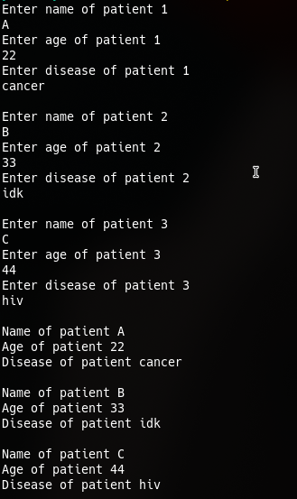
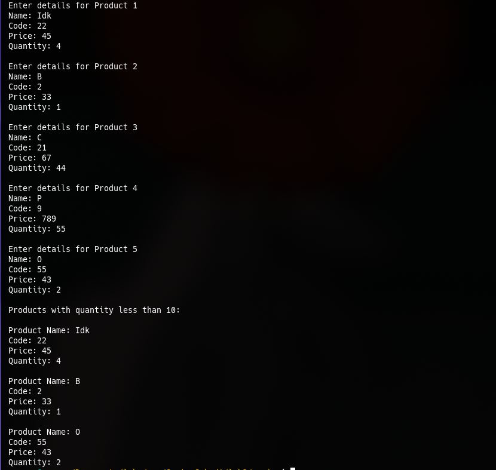

* LAB 2: Basics of C++

** Discussion:
 From this lab, we are able to learn the basics of C++ programing.

 The basics of C++ is very similar to C, as we observed in this lab, mos data structure like arrays & structs are same as in C

 Here is the output of the lab code:

 [[./output1.png]]
 
 [[./output3.png]]
 [[./output4.png]]
 
 [[./output6.png]]
 

** Conclusion:
From this lab, we are able to conclude that the basics of C++ & C are very similar, and the main difference in extra features added in top of C's existing ones.
